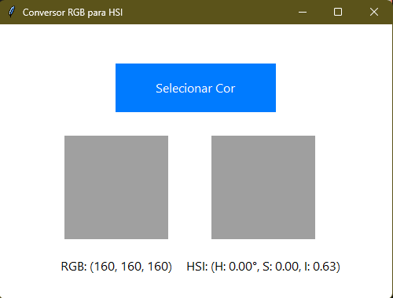
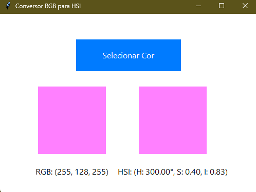

# Conversor de Cores RGB para HSI

Este projeto implementa um programa em **Python** que realiza a conversão de valores de cores do modelo **RGB** para o modelo **HSI** sem o uso de bibliotecas prontas. O programa inclui uma interface gráfica simples que:

1. Recebe as coordenadas de cor no modelo **RGB**.
2. Exibe a cor correspondente em um retângulo/quadrado.
3. Converte a cor para o modelo **HSI** e exibe o resultado em outro retângulo/quadrado.

## Funcionalidades

- Conversão precisa de cores do modelo RGB para HSI.
- Interface gráfica para entrada de valores e visualização dos resultados.
- Exibição de exemplos visuais da conversão em retângulos/quadrados de cores.

## Estrutura do Projeto

```plaintext
├── main.py           # Arquivo principal do programa
├── README.md         # Documentação do projeto
├── exemplos/         # Pasta com prints da interface e conversões
    ├── exemplo_1.png
    ├── exemplo_2.png
```

## Requisitos

Para rodar este projeto, é necessário:

- **Python 3.8+**
- **Tkinter** (biblioteca padrão para interfaces gráficas no Python)

## Como Rodar o Programa

1. Clone este repositório:
   ```bash
   git clone https://github.com/SeuUsuario/Conversor-RGB-HSI.git
   cd Conversor-RGB-HSI
   ```
2. Execute o arquivo `main.py`:
   ```bash
   python main.py
   ```

3. Insira os valores RGB no formato (0-255) e clique no botão para ver o resultado.

## Conversão de Cores

A conversão de RGB para HSI é implementada manualmente com base nas fórmulas matemáticas, seguindo os passos:

1. **Normalizar os valores RGB para o intervalo [0, 1]**.
2. **Calcular os componentes H (Hue), S (Saturation), e I (Intensity)**.
   - Hue (\( H \)) é calculado considerando a diferença entre os valores de cor e ajustando a fórmula para o intervalo correto.
   - Saturation (\( S \)) é a medida de quão pura é a cor, variando de 0 a 1.
   - Intensity (\( I \)) é a média dos valores RGB normalizados.

## Exemplos

### Exemplo 1: Conversão de Vermelho Puro

Entrada RGB: (255, 0, 0)

Resultado HSI:
- H: 0.0°  
- S: 1.0  
- I: 0.333  



### Exemplo 2: Conversão de Verde Puro

Entrada RGB: (0, 255, 0)

Resultado HSI:
- H: 120.0°  
- S: 1.0  
- I: 0.333  



## Contribuição

Sinta-se à vontade para abrir issues ou enviar pull requests com melhorias para o projeto.

## Licença

Este projeto está licenciado sob a [MIT License](LICENSE).

--- 

**Autor:** Nathália Bacalhau  
*Transformando desafios em aprendizado prático!*
